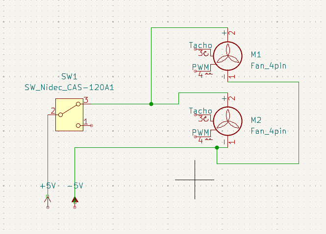

# FILADRIER  
### *A DIY Filament Dryer for Better 3D Prints*

<p align="center">
  
</p>

---

## Overview

**FilaDrier** is a DIY filament dryer designed to keep 3D printer filament dry and protected from moisture.

Wet filament can ruin print quality and lead to issues such as:

- Stringing  
- Popping or crackling sounds while printing  
- Weak layer adhesion  
- Brittle or weak prints  
- Poor surface finish  

FilaDrier helps reduce these problems by circulating air through a **silica gel filtration system** inside a sealed enclosure to maintain lower humidity levels.

This project is designed to be:

- Budget-friendly  
- Easy to build  
- Compact  
- Print-direct compatible  

---

## Features

- Airtight dry box design  
- Dual fan air circulation system  
- Silica gel moisture absorption  
- PTFE filament routing system  
- Direct print-from-box support  
- Temperature & humidity monitoring  
- Quiet operation using laptop fans  
- DIY and customizable

---

---

## Bill of Materials (BOM)

| # | Component | Purpose | Qty | link  |
|---|---|---|---|---|
| 1 | Micro USB Cable | Power connection | 1 | https://www.amazon.in/gp/product/B09MNFNNVZ/ref=ox_sc_act_title_11?smid=A1WYWER0W24N8S&psc=1 |
| 2 | HP Laptop Cooling Fan (4-Pin) | Air circulation | 2 | https://www.amazon.in/Time-3D-Tetra-Fluoro-Ethulene/dp/B0CKBSZFP6/ref=cart_prsubs_d_sccl_3/524-8491303-9102210?pd_rd_w=ytbCm&content-id=amzn1.sym.7e6f4ca7-742c-40dd-aa7f-9aaaec0c906b&pf_rd_p=7e6f4ca7-742c-40dd-aa7f-9aaaec0c906b&pf_rd_r=53W32VP3AP9HFCA0J9WF&pd_rd_wg=XSHb8&pd_rd_r=4c244c60-9feb-4da9-8570-fe209e4c505d&pd_rd_i=B0CKBSZFP6&th=1 |
| 3 | Airtight Storage Containers | Main dryer enclosure | 2 |  https://www.amazon.in/gp/product/B0FR484TLT/ref=ox_sc_act_title_14?smid=AXOGFIT0PZZ7G&psc=1 |
| 4 | PC4-M6 Pneumatic Connector | Filament pass-through | 2 | https://www.amazon.in/gp/product/B0CKBTVZ9T/ref=ox_sc_act_title_15?smid=AAJQ3K54TZ6MM&th=1 |
| 5 | PTFE Tube (4mm OD, 2mm ID) | Filament guide path | 1 | https://www.amazon.in/Time-3D-Tetra-Fluoro-Ethulene/dp/B0CKBSZFP6/ref=sr_1_3?crid=8ALOYXJBCH3I&dib=eyJ2IjoiMSJ9.mqAnoObkZFxyyzpvULjQQe6MZuiwqv-VYl5ur-w86jILDtuqysRBmHFT2PGjnGkzMtRjF69ZHqcq5p3Lo18TKAOmmH8q0op9HWjrVLy9F2c2HrNEmrMH62OboY3dWygG5AYb-XFwp47hJ1EQjB6vfDFut3N2SgaztXy9BziGzDG1ylLvCsQ2aXCc3fMkhXDSUFYzxHC7FhIfeEcS9S46ozttlw2ls775j76LhUGGtlvWPjp4IT6PsfCh6tTJ6DpPsRe3su53rU-bk3wlCSJtiyH-OQfqy5tnPVAyUWh5Fgc.chzGI-DMuYY1hFKvC49jGRrj-Z5_7J9sHJ7wQeSZyC8&dib_tag=se&keywords=ptfe%2Btube&qid=1781898036&sprefix=ptfe%2Caps%2C280&sr=8-3&th=1 |
| 6 | M3 Screws & Nuts Assortment | Assembly / Mounting | 1 Kit | https://www.amazon.in/Phillips-Screws-pieces-Stainless-Assorted/dp/B0H21GVDZ6/ref=sr_1_17?dib=eyJ2IjoiMSJ9.qeaFFacOjI_CDmvulhcWbU3RG2uS-R6aRqpuf1x4hGC_3DCAB5NZ0U9QXrEREGf_7qo3CZuntWegFBn9DR7MzYMniy9yK5HlRpQrStTfjlSg6epKyuvVn6C_U1zbPzCIbhpvT3pTNpT3WQxX7gtBXvSGdCZp67F3cIlZYVO1emh6c72i75GZBveQGvdhvKTY9G-7L0ELT8YW-f4hhVF20o-VIKQJaWjB3x8rjH9kRoXFfisdKEMkOYIf0SPuWynzwv0LyS8am1uce7TF9DDVAjJYR70GaVpco1M5O2A4Ef8.objfV4eM_c49QSYp0zOgL60TN2_Bery2keG-JRjpjI8&dib_tag=se&keywords=m3+screws&qid=1781898100&sr=8-17 |
| 7 | ball bearings  | rotating base | 1 | https://www.amazon.in/gp/product/B0D5H72295/ref=ox_sc_act_title_17?smid=A1V350QXQFOZZS&th=1 |
| 8 | bread board and wires | Wiring connections and testing | 1 Pack | https://www.amazon.in/ePro-Labs-KIT-0010-Breadboard-Pieces/dp/B01BLJGS7M/ref=sr_1_13_mod_primary_new?crid=1PZ4L6M35P0NS&dib=eyJ2IjoiMSJ9.NpiqG_GJTt7YLKhI8CJEN9pTX6fMRTcLXJxd-_GekMPcnwkdD1h4u-2kdh9SgHCE-jGyW_ISrTzErExY-RNiHOGCxanZDpq6pFiHm8QYJC01vLhXiC1NVI6TJbrA4zG64Dt9F-CQK7djhKPSmBjLyZ-ZhXiIAcUIwxJA43Tc8UWRWAxnFEg4Ho5pWqAsN3IBOhPHTKrvMy8al2GXysvEyb6lbVBTu8aJIQ_H_x_ippKhQxev6flc9Y0pJHjBnf7Qa6WTckWJsouTa7tCKObqLM29BkTy4ZOTCiDuyLfq7zc.l4YbAjNaEO6TDnvOZN5oUgYPDvon85qRFz0s4vEV1Pw&dib_tag=se&keywords=jumper+wire+set&qid=1781898312&sbo=RZvfv%2F%2FHxDF%2BO5021pAnSA%3D%3D&sprefix=jumper+wire+set%2Caps%2C308&sr=8-13 |
| 9 | SPDT Mini Toggle Switch | ON/OFF control | 1 | https://www.amazon.in/gp/product/B09WDKT8DK/ref=ox_sc_act_title_19?smid=AJ6SIZC8YQDZX&psc=1 |
| 10 | Silica Gel Beads (Blue) | Moisture absorption | 1 Pack | https://www.amazon.in/gp/product/B0D96715G3/ref=ox_sc_act_title_20?smid=AB1WHZOSLF8K&th=1 |
| 11 | Mini LCD Temperature/Humidity Meter | Temperature & humidity monitoring | 1 | https://www.amazon.in/Gadget-Heros-Hygrometer-Temperature-Thermometer/dp/B0146CP5FC/ref=sr_1_50?crid=34EU6W0NGM7LT&dib=eyJ2IjoiMSJ9.T2iBjlFdWD8qcEET9bAwaIXa4yRfz9PlX0TNaBV0dg9yHc4NsQCJ6z9ZGZMThYRP3VnIgQ_RLrF7Py_8M_Pc73BCINo4Z4NJODWjfRGge5oG9pnQ7c44C6IN0fUL1K9KKPi_rAoulpSNZaaEVMgVoDWJxMVme0SRjxazjp3HtdsaKgxcOdH0McsRqdcmXSaL-ba5lmZhytrd9KlOX86LokMxNDH3KBt7PmY9QMGnXQWvToXa1IcaGWJzowsGoO_S1yjPj2CLWJbAaDdV9EHxp8OHPzdswrj4-RA8U7TC0pI.yilCopIsXW5uGFzOVdJFjA2tOZWlyH7wDHaFzA17VGU&dib_tag=se&keywords=humidity+meter&qid=1781898575&sprefix=humidity+%2Caps%2C316&sr=8-50 |
---

## Required 3D Prints

Print the following models before assembly.

### 1. Dry Box

https://makerworld.com/en/models/39426-dyna-dry-box-filament-box-4l#profileId-38638

### 2. Compact PTFE Socket

https://makerworld.com/en/models/16294-compact-fitting-socket-for-dry-box#profileId-26865

### 3. External Air Dryer Parts

Print the external air dryer files included with this project.

---

## Tools Required

You may need:

- Soldering iron  
- Wire stripper  
- Drill or rotary tool  
- Hot glue or screws (optional)  
- Small screwdriver set  

---

# Assembly Guide

---

## Step 1: Print & Order Parts

Print all required 3D files and order all parts from the BOM.

Before assembly, make sure you have:

- Printed parts  
- Fans  
- Switch  
- Silica gel  
- PTFE fittings and tube  
- Hygrometer  
- USB cable

---

## Step 2: Assemble the Rotary Base

Assemble the rotary spool holder/base.

Make sure:

- The spool rotates smoothly  
- There is minimal friction  
- Filament can unwind properly

This helps prevent feeding issues during printing.

---

## Step 3: Install Components Inside the Box

Place the following inside the container:

### Inside the box:
- Rotary spool holder  
- Hygrometer / temperature-humidity meter

Position the hygrometer somewhere visible for easy monitoring.

---

## Step 4: Add PTFE Tube Openings

Create **3 holes** in the wall of the container wherever preferred.

Install the **PC4-M6 pneumatic fittings**.

These will act as filament routing ports.


Insert the PTFE tube through the fittings.

---

## Step 5: Add Airflow Holes

Create:

- **1 intake hole**
- **1 exhaust hole**

for the external air dryer.

Suggested airflow direction:

```text
Outside Air
      ↓
Intake Fan
      ↓
Silica Gel Chamber
      ↓
Air Filter
      ↓
Exhaust Fan
      ↓
Dry Box Interior
```

This allows moisture to be absorbed before air enters the enclosure.

---

## Step 6: Assemble the Air Dryer Module

Mount the system to the wall of the container in this order:

```text
Intake Fan → Silica Gel → Filter → Exhaust Fan
```

### Airflow explanation

**Fan 1 (Intake Fan)**  
Pulls air into the drying chamber.

**Silica Gel Chamber**  
Removes moisture from incoming air.

**Filter**  
Prevents dust or silica particles from entering the enclosure.

**Fan 2 (Exhaust Fan)**  
Pushes dried air into circulation.

Mount everything securely to avoid rattling.

Rubber dampers can be used to reduce vibration.

---

## Fan Wiring




Your HP laptop fans use 4 wires:

```text
Red    = +5V
Black  = GND
Yellow = Ignore
White  = Ignore
```

Only connect:

- **Red**
- **Black**

The other two wires are unnecessary for this build.

---

## Wiring Schematic

Connect both fans **in parallel**.

```text
                 ┌──────── Fan 1 Red
USB +5V ─ Switch ┤
                 └──────── Fan 2 Red


                 ┌──────── Fan 1 Black
USB GND ─────────┤
                 └──────── Fan 2 Black
```

### Important:
Do **NOT** connect the fans in series.

Both fans must receive the full **5V** supply.

---

## USB Power Setup

Take a Micro USB cable and strip it.

Inside you will usually find:

```text
Red   = +5V
Black = GND
White = Ignore
Green = Ignore
```

Connect:

```text
USB Red   → Fan Red wires
USB Black → Fan Black wires
```

Then connect the USB cable to:

- USB adapter  
- Power bank  
- Computer USB port

A **5V 2A adapter** is recommended.

---

## Using Silica Gel

Add silica gel beads to the drying chamber.

Recommended:

- Keep silica separate from filament  
- Use mesh or compartments  
- Replace or regenerate silica when saturated

Blue silica typically changes color when moisture is absorbed.

---

## How to Use

1. Place filament spool inside the box  
2. Feed filament through PTFE tube  
3. Turn ON the switch  
4. Monitor humidity using the hygrometer  
5. Print directly from the enclosure

For best results:

- Keep the box sealed  
- Avoid opening frequently  
- Regenerate silica regularly

---
## Renders 

.png)

---

## Contributing

Feel free to improve, remix, or modify this project.

Pull requests and ideas are welcome.

---

## License

This is an open-source DIY project.

Feel free to modify and share.

---

<p align="center">
Made for better prints and dryer filament.
</p>

